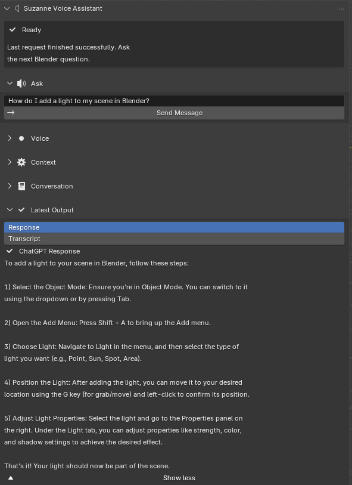
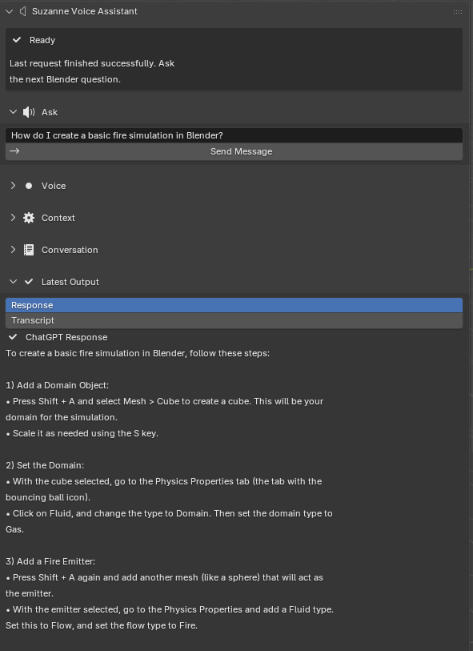
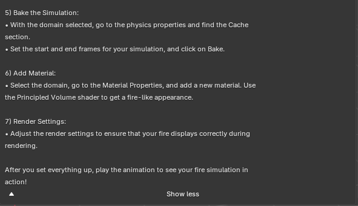
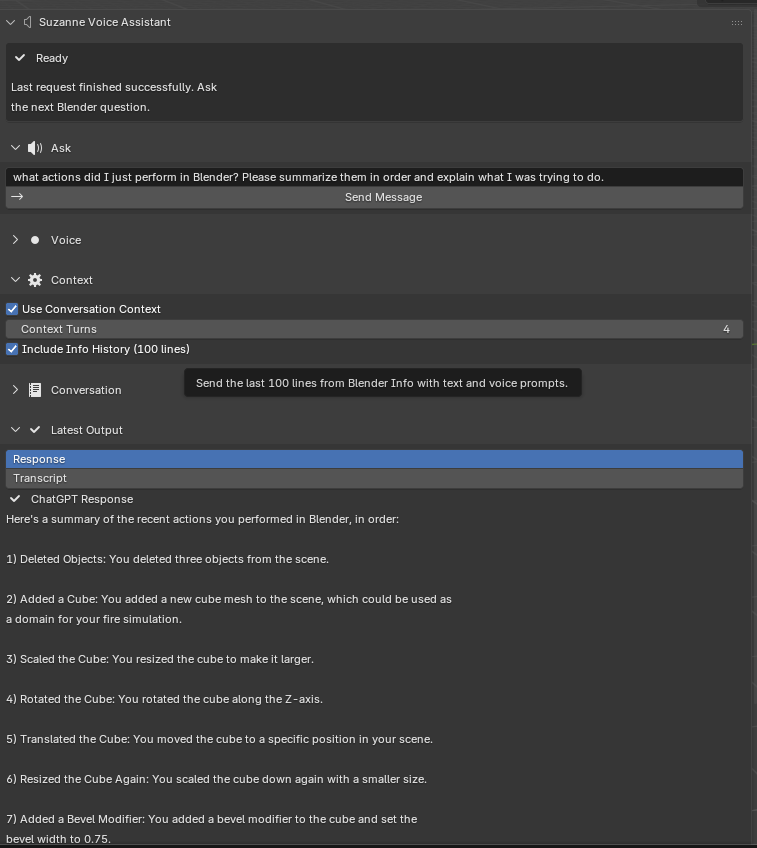
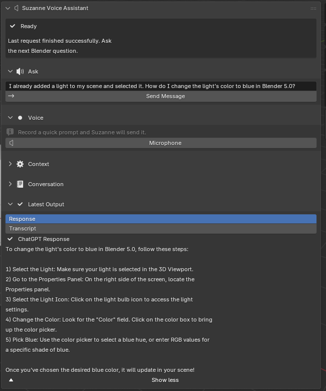
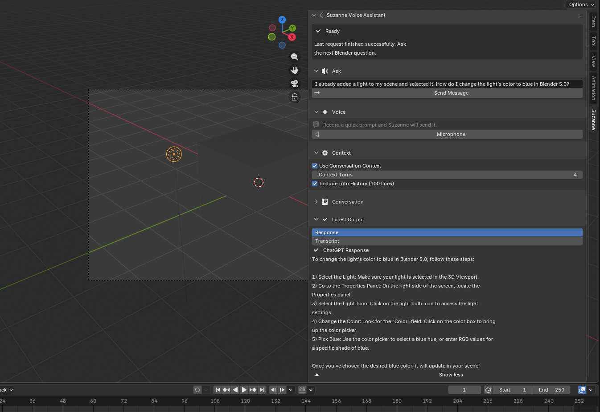
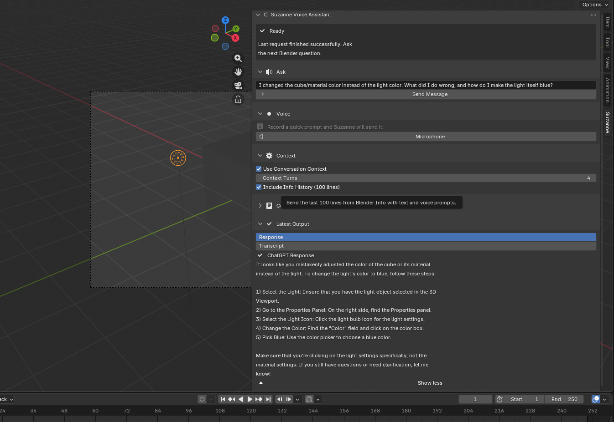

# Experiments

This chapter evaluates Suzanne at two levels. First, it reports a completed software-verification pass over the Blender add-on implementation. Second, it presents four task-based experiments that demonstrate how Suzanne supports representative portfolio-oriented Blender workflows inside the viewport. This structure keeps the claims matched to the evidence: the automated suite evaluates deterministic software behavior, while the task experiments evaluate whether Suzanne can deliver usable instructional support for simple, complex, context-aware, and corrective workflows.

## Experimental Design

### Evaluation goals and research questions

The evaluation is organized around three practical research questions:

1. **RQ1: Reliability.** Do Suzanne's core interaction paths behave consistently enough to support repeated use inside Blender?
2. **RQ2: Task support.** Can Suzanne provide usable in-viewport guidance for representative Blender tasks without forcing the workflow out into external search?
3. **RQ3: Instructional clarity and context.** Do Suzanne's responses remain clear, actionable, and context-sensitive enough to support learning-oriented Blender work?

These questions follow directly from the claims made in the Introduction and Methods chapters. Suzanne is not framed as a fully autonomous copilot; it is framed as an in-viewport instructional tool whose value depends on stable interface behavior, actionable task guidance, and user trust [@8506568; @luo2025ailearningtools].

### Staged evaluation structure

The evaluation is staged across deterministic verification and task-based demonstrations.

Table: Evaluation layers used in this chapter

| Evaluation layer | Purpose | Evidence presented here |
|:--|:--|:--|
| Software verification | Confirm deterministic behavior of operators, panel rendering, preferences, and state transitions | Automated Python test suite with `65` passing checks |
| Task-based evaluation | Demonstrate usable in-viewport guidance across representative Blender workflows | Four authored experiments covering basic question answering, complex procedure generation, context-aware action reconstruction, and corrective error recovery |

This design fits the realities of Blender add-on development. Some claims are best tested through automation, such as whether blank prompts are rejected or whether an error state is rendered correctly. Other claims are best illustrated through concrete task runs in the Blender interface, where Suzanne's generated guidance can be inspected directly as numbered in-panel instructions, longer procedural responses, or context-aware summaries of recent user actions. In this chapter, that evidence is presented through captured N-panel outputs and experiment summaries that pair each prompt with the returned guidance and the observed outcome.

### Evaluation scope

This chapter reports completed software-verification results and task demonstrations executed inside Blender. Accordingly, the claims supported here are about system stability, procedural usefulness, and task coverage rather than population-level usability outcomes.

### Qualitative success criteria

Because this chapter does not report an inferential user study, the task-based evaluation uses a transparent qualitative rubric rather than statistical outcome claims. The rubric focuses on dimensions directly tied to Suzanne's thesis claims and to the prior literature on worked examples, tutoring systems, and human-AI interaction [@Atkinson_2000; @VanLEHN_2011; @Amershi_2019; @Shneiderman_2020]. Each task run is interpreted through the following dimensions:

Table: Qualitative rubric used for task-based evaluation

| Dimension | What counts as `High` | What counts as `Moderate` | What counts as `Low` |
|:--|:--|:--|:--|
| Procedural correctness | Steps align closely with documented Blender workflow and contain no visible major error | Workflow is broadly plausible but may omit detail or require interpretation | Workflow is misleading, out of order, or visibly inconsistent with Blender behavior |
| Actionability | User can act immediately from the response with minimal inference | Response is partly actionable but requires some prior knowledge or guesswork | Response is mostly conceptual or too vague to execute |
| In-workspace locality | Help can be consumed and applied entirely from the N-panel context | Help remains in-panel but requires substantial scrolling or reformatting by the user | Help effectively breaks the in-viewport workflow |
| Transparency and user control | Status, response, and any suggested code remain visible and user-mediated | Most behavior is visible, with some ambiguity about assumptions | Behavior is opaque or implies action without user review |
| Context sensitivity | Output clearly uses relevant attached context when the task asks for it | Output shows some context use but remains partly generic | Output ignores or misuses provided context |

For the purposes of this chapter, a task run is considered **successful** when every task-relevant dimension is at least `Moderate` and no task-relevant dimension falls to `Low`. Context sensitivity is treated as not applicable unless the experiment explicitly depends on contextual features. This threshold is intentionally conservative: a response can be imperfect and still useful, but it cannot count as successful if it becomes misleading or operationally inert.

## Evaluation

### Completed software verification

Before the task demonstrations, the build was tested as a software artifact. The Suzanne repository includes a Python test suite covering operators, panel behavior, preferences, state registration, and shared utility functions. These tests use a mocked `bpy` environment so that Blender-specific logic can be exercised repeatably without manual clicking inside the UI. In practice, this means the test harness installs lightweight stand-ins for Blender's Python modules and types, including fake `bpy`, `bpy.types`, and `bpy.props` objects, along with test versions of `Scene`, preferences, operators, and context state. The add-on code can then be imported and executed as if Blender were present, while the tests still control the prompt text, status fields, reports, and preferences values directly in Python. This is especially useful for edge cases that are tedious to reproduce by hand, such as missing API keys, offline requests, empty output panes, or repeated property registration.

The first set of checks verifies that Suzanne rejects invalid input early and with a readable message:

```python
def test_send_message_execute_rejects_blank_prompt():
    modules = load_suzanne_modules()
    context = make_context(
        modules.common.ADDON_MODULE,
        scene=make_scene(suzanne_va_prompt="   "),
    )
    operator = modules.operators.SUZANNEVA_OT_send_message()

    result = operator.execute(context)

    assert result == {"CANCELLED"}
    assert operator._reports[-1][1] == "Please type a message first."
```

This test matters because a tutoring tool that fails opaquely can interrupt learner momentum faster than one that simply refuses an invalid request. The desired behavior is not only cancellation, but cancellation with a concrete, beginner-readable explanation.

The next example verifies that network failure surfaces a visible error state instead of silently failing:

```python
with mock.patch.object(
    modules.operators,
    "_call_chatgpt",
    side_effect=modules.operators.URLError("offline"),
):
    result = operator.execute(context)

assert result == {"CANCELLED"}
assert scene.suzanne_va_status == "Idle (error)"
assert "Send failed" in operator._reports[-1][1]
```

This supports one of the main design goals established in Methods: failure should be explicit and recoverable. In a classroom or portfolio workflow, a user needs to know whether a poor outcome came from their Blender steps, their prompt, or the external service connection.

A third group of checks verifies that the panel communicates state clearly:

```python
scene.suzanne_va_status = "Idle (error)"
assert sidebar._status_presentation(scene, False) == (
    "Error",
    "Idle (error)",
    "ERROR",
    True,
)
```

Even though this is a small UI test, it is directly relevant to the thesis argument. Suzanne is meant to reduce micro-execution confusion, so its own status language must stay simple and legible. The suite also checks other presentation branches, including `Ready`, `Sending...`, `Recording...`, conversation empty states, and the hiding of API-key details in preferences.

The `65` passing checks were not concentrated in one narrow path. When the suite was collected, it consisted of `23` operator checks, `25` shared-utility/helper checks, `8` panel/UI checks, `4` add-on registration/init checks, `2` preference checks, `2` state-lifecycle checks, and `1` support-harness check. The following table groups those counts into the main verification areas exercised across the add-on.

Table: Summary of current automated verification outcomes

| Test family | Checks | What the checks verified | Why it matters |
|:--|--:|:--|:--|
| Shared utilities and helper logic | `25` | Text cleanup, preview formatting, status mapping, Info-history helpers, storage helpers, HTTP wrappers, path resolution, and fallback branches in common utility code | Confirms the low-level support functions behave consistently before they are used by the UI and operators |
| Operators and interaction pipelines | `23` | Prompt validation, send-message flow, microphone flow, diagnostics operators, conversation actions, API-key checks, and success/error branches across the main interaction logic | Confirms the core interaction loop works end to end and fails visibly when something goes wrong |
| Panel rendering and UI states | `8` | Status-card presentation, collapsed/expanded cards, output previews, empty states, conversation previews, and general panel draw behavior | Keeps the interface legible and predictable during real task work |
| Registration and state lifecycle | `6` | Add-on `register()` / `unregister()` behavior, property creation/removal, and repeated setup/teardown paths | Prevents instability across repeated runs and supports reproducible Blender enable/disable cycles |
| Preference safety and setup | `2` | API-key masking/reveal behavior and diagnostics controls in the preferences UI | Supports trust and safer configuration without exposing sensitive setup details |
| Support harness | `1` | Test-harness module loading and import-path setup for the stubbed Blender environment | Ensures the automated verification setup itself can reliably import and exercise the add-on code |

Together, these categories account for the full breadth of the `65` collected checks. The significance of the test suite is therefore not only the number itself, but the spread of coverage across helper logic, interaction flow, UI behavior, setup safety, and add-on lifecycle management.

When the local test suite was executed, all `65` checks passed in `0.30` seconds. This is not the same as proving that every model-generated instruction is correct. What it does show is that the non-model scaffolding around Suzanne is stable: validation works, user-facing failures are surfaced, panel states are coherent, and repeated runs do not corrupt add-on state. For a system intended to support learners, this reliability layer is a necessary prerequisite for broader usability claims.

### Task-based evaluation

The four task-based experiments below move from a simple instructional query to a longer procedural workflow, then to a context-aware reconstruction task, and finally to a corrective troubleshooting exchange after a user mistake. Together, they show how Suzanne behaves when used as an in-viewport guide for increasingly demanding kinds of support.

#### Experiment 1: Basic question answering in the Blender viewport

The first task-based experiment tests Suzanne's most basic instructional path: whether a user can ask a simple Blender question inside the add-on and receive a correct, readable, and immediately actionable response without leaving the interface. For this trial, the prompt entered into Suzanne was, "How do I add a light to my scene in Blender?" This is a suitable first test because lighting is a common beginner workflow, the expected procedure is easy to verify, and the task exercises the core text-query pipeline from prompt entry to visible response.

{fig-cap="Experiment 1: Suzanne answers a basic lighting question in Blender's N-panel with step-by-step procedural guidance. Screenshot by the author." width=80%}

Suzanne returned a numbered, step-by-step answer that instructed the user to remain in Object Mode, open the Add menu with `Shift + A`, choose a light type, position the light, and then adjust its properties in the right-side panels. This response is functionally correct for standard Blender interaction and uses interface terms that match what a beginner would actually see on screen. Just as importantly, the answer is procedural rather than vague. Instead of describing lighting conceptually, Suzanne gives the user a sequence they can follow immediately in the same workspace.

Table: Summary of Experiment 1

| Aspect | Observation |
|:--|:--|
| Goal | Verify that Suzanne can answer a simple Blender question correctly inside the N-panel |
| Prompt | "How do I add a light to my scene in Blender?" |
| Observed output | Suzanne produced a short numbered procedure for adding, placing, and adjusting a light |
| Outcome | Successful |
| Interpretation | Suzanne's baseline question-answering workflow functioned correctly and provided usable in-viewport guidance |

This experiment establishes that Suzanne's simplest interaction loop is already useful at the point of use. Before the system can be trusted with longer workflows, it must first show that it can handle ordinary interface questions correctly and clearly.

Under the qualitative rubric, Experiment 1 scores strongly on procedural correctness and actionability. The steps correspond closely to a standard Blender lighting workflow, and the user can apply them immediately without reconstructing hidden prerequisites. In worked-example terms, this is the cleanest case for Suzanne's design: the task is narrow, the solution is short, and the response can be consumed almost as a miniature recipe [@Atkinson_2000].

The experiment is also significant because it shows that keeping the answer inside the N-panel preserves locality well. The response fits the interface without becoming burdensome to read, so the user can move directly from question to action. This is the kind of low-friction interaction that external tutorials often fail to provide, even when their instructional content is correct, because the learner must still translate from another medium back into the active scene.

#### Experiment 2: Complex procedural guidance for fire simulation

The second task-based experiment tests whether Suzanne can support a more advanced Blender workflow that requires multiple ordered setup steps rather than a short, single-action answer. For this trial, the prompt entered into Suzanne was, "How do I create a basic fire simulation in Blender?" Fire simulation is a stronger stress test than the first experiment because it involves several connected systems, including a simulation domain, a flow emitter, physics settings, material setup, and baking or caching behavior. In other words, the task is complex enough that an incomplete or poorly ordered answer would be much harder for a user to apply successfully.

Because Suzanne's response exceeded the visible height of the N-panel, the result was captured in two screenshots.

{fig-cap="Experiment 2, part 1: Suzanne begins a multi-step explanation for creating a basic fire simulation in Blender. Screenshot by the author." width=80%}

{fig-cap="Experiment 2, part 2: Suzanne continues the fire-simulation workflow with baking, material, and render guidance. Screenshot by the author." width=80%}

Suzanne returned a structured, ordered procedure that included creating a domain object, configuring the domain as a gas simulation, adding a separate emitter, setting the emitter as a fire flow source, baking the simulation, assigning a material, and adjusting render settings. This is the kind of longer procedural answer that Suzanne is intended to support: it keeps the user inside Blender while still presenting a workflow that would otherwise require searching across multiple external references.

The generated response is also broadly consistent with the standard workflow described in the Blender Manual, which explains that gas simulations require at least a domain object and a flow object, followed by material assignment and cache baking [@blender-manual]. Suzanne's answer therefore appears substantively correct at the workflow level, even though this experiment documents procedural completeness rather than a timed benchmark.

Table: Summary of Experiment 2

| Aspect | Observation |
|:--|:--|
| Goal | Evaluate whether Suzanne can provide usable guidance for a more complex Blender simulation task |
| Prompt | "How do I create a basic fire simulation in Blender?" |
| Observed output | Suzanne produced a multi-step workflow covering domain setup, emitter setup, bake steps, material assignment, and render considerations |
| Outcome | Successful as a complex-response test |
| Interpretation | Suzanne handled a longer, more technically demanding query and returned guidance that broadly matches documented Blender workflow |

This second experiment strengthens the evaluation by showing that Suzanne is not limited to very short beginner questions. It can also generate longer instructional sequences for tasks that involve several dependent setup stages, which is central to the thesis claim that in-viewport guidance can reduce friction for practical Blender work.

Experiment 2 also reveals an important trade-off. Procedural completeness improves actionability for a complex task, but it places pressure on the interface because the output extends beyond the visible panel height. In other words, the add-on succeeds on instructional granularity while partially stressing the locality dimension. The response still remains inside Blender, which is an advantage over external search, but long workflows begin to test how much step-oriented guidance a sidebar can comfortably hold at once.

This trade-off is methodologically useful rather than embarrassing. It shows that the main bottleneck in this experiment is not whether Suzanne can produce a relevant workflow, but how that workflow should be staged, chunked, or progressively revealed in the viewport. The result therefore supports the thesis while also motivating future refinements such as collapsible step groups, task phases, or lightweight checkpoint prompts. In human-AI terms, the assistant remains helpful, but the interface begins to mediate the quality of that helpfulness [@Amershi_2019].

The experiment also demonstrates that success for Suzanne does not require autonomous execution. A fire simulation is exactly the kind of multistage task that an automation-first copilot might attempt to perform directly. Suzanne instead succeeds by producing an ordered scaffold that the user can inspect and follow. This keeps the model in an advisory role while still providing meaningful task support for a complex workflow.

#### Experiment 3: Context-aware reconstruction of recent Blender actions

The third task-based experiment evaluates Suzanne's context feature rather than its general question-answering ability alone. In this trial, the `Include Info History (100 lines)` option was enabled in the Context panel, and the user asked, "what actions did I just perform in Blender? Please summarize them in order and explain what I was trying to do." This is an important test because it asks Suzanne to infer recent activity from Blender session history instead of answering a generic procedural question from prior knowledge alone.

As with the previous experiment, the response extended beyond the visible panel height and was captured in two screenshots.

{fig-cap="Experiment 3, part 1: Suzanne uses the enabled Info History context to summarize recent Blender actions in order. Screenshot by the author." width=80%}

{fig-cap="Experiment 3, part 2: Suzanne completes its summary of the recent Blender actions. Screenshot by the author." width=80%}

Suzanne responded with an ordered summary of recent scene operations, including deleting objects, adding a cube, scaling it, rotating it, translating it, resizing it again, adding a bevel modifier, and applying smooth shading. It then interpreted those actions as part of a likely modeling workflow, specifically suggesting that the cube may have been prepared as a domain object for a fire simulation. This is a meaningful result because it shows Suzanne using recent session context to produce a situationally grounded explanation rather than only returning generic help text.

Methodologically, this experiment is especially relevant to the thesis because it addresses one of the core limitations of many external help sources: they do not know what the user has just done. By contrast, Suzanne can incorporate Blender's recent Info history and reflect it back into the conversation. In the captured session, conversation context was also enabled, so this example should be interpreted as evidence of context-aware assistance rather than as an isolated benchmark of Info-history retrieval alone. Even with that caveat, the response clearly tracks recent viewport activity in a way that ordinary static documentation cannot.

Table: Summary of Experiment 3

| Aspect | Observation |
|:--|:--|
| Goal | Evaluate whether Suzanne can use recent Blender session context to infer and summarize user actions |
| Prompt | "what actions did I just perform in Blender? Please summarize them in order and explain what I was trying to do." |
| Observed output | Suzanne reconstructed an ordered sequence of recent modeling operations and inferred the likely purpose of the workflow |
| Outcome | Successful as a context-aware assistance test |
| Interpretation | Suzanne used recent session context to generate a grounded, workflow-specific explanation rather than only generic Blender advice |

Experiment 3 scores differently from the first two because its value lies less in procedural instruction and more in situated interpretation. The main success condition is context sensitivity: did Suzanne actually use the attached Blender history to reconstruct recent actions rather than falling back to generic language? The captured output suggests that it did. The assistant names concrete operations in sequence and offers a plausible higher-level explanation of the task being attempted. That is precisely the behavior the context features were meant to enable.

At the same time, this experiment exposes a distinct risk: interpretation can drift beyond observation. Suzanne does not merely repeat the action log; it infers likely intent. That inference is useful, but it is also less certain than simply listing an operator path. The experiment therefore illustrates a different trade-off from Experiment 2. There, the challenge was balancing completeness against panel space. Here, the challenge is balancing grounded description against over-interpretation. Because the inferred purpose remained plausible and clearly tied to visible actions, the run still counts as successful, but it also highlights why context-aware assistance should remain advisory rather than authoritative.

This context behavior is significant for the broader thesis because it addresses one of the strongest limitations of traditional tutorials: they rarely know what the learner just did. In practice, a browser tutorial or static manual page can explain *a* workflow, but it cannot usually summarize *your* recent workflow. Suzanne's context-aware path is therefore not just an interface novelty. It is a capability difference that makes in-viewport assistance meaningfully more situated.

#### Experiment 4: Corrective guidance after a user mistake

The fourth task-based experiment evaluates whether Suzanne can support error recovery after a user follows a workflow incorrectly. This matters because many novice Blender problems are not failures to ask a first question, but failures to recover after applying the right idea to the wrong object, panel, or mode. In this trial, the user first asked Suzanne, "I already added a light to my scene and selected it. How do I change the light's color to blue in Blender 5.0?" Suzanne responded with a short step-by-step procedure that directed the user to select the light, open the Properties editor, click the light-bulb tab, and change the `Color` field.

{fig-cap="Experiment 4, part 1: Suzanne provides the initial light-color workflow in Blender's N-panel. Screenshot by the author." width=80%}

To test corrective behavior rather than only first-pass instruction, the user then performed the task incorrectly by changing the cube or material color instead of the light color. This is a useful stress test because it captures a realistic beginner confusion between object/material settings and light settings. The follow-up prompt was, "I changed the cube/material color instead of the light color. What did I do wrong, and how do I make the light itself blue?" Unlike Experiment 3, this task does not depend on Blender Info-history reconstruction; instead, it evaluates whether Suzanne can remain helpful once the user explicitly reports a mistaken intermediate step.

{fig-cap="Experiment 4, part 2: The task is intentionally performed incorrectly by changing the wrong target before asking Suzanne for correction. Screenshot by the author." width=80%}

{fig-cap="Experiment 4, part 3: Suzanne diagnoses the mistake and redirects the user to the correct light settings. Screenshot by the author." width=80%}

Suzanne's correction response explicitly identified the problem as changing the cube or its material rather than the light. It then restated the relevant fix as a short ordered procedure: select the light object, open the Properties panel, choose the light icon, find the `Color` field, and set it to blue. This is the behavior the experiment was designed to test. Suzanne did not merely repeat generic lighting advice; it acknowledged the user's reported mistake and redirected the workflow to the correct target.

Table: Summary of Experiment 4

| Aspect | Observation |
|:--|:--|
| Goal | Evaluate whether Suzanne can diagnose and correct a common novice mistake during a Blender lighting task |
| Prompt | "I already added a light to my scene and selected it. How do I change the light's color to blue in Blender 5.0?" followed by "I changed the cube/material color instead of the light color. What did I do wrong, and how do I make the light itself blue?" |
| Observed output | Suzanne first gave a correct light-color procedure, then identified the wrong target and redirected the user to the light settings |
| Outcome | Successful as an error-recovery test |
| Interpretation | Suzanne supported conversational troubleshooting by correcting a realistic workflow mistake rather than only answering the initial question |

Methodologically, this experiment strengthens the thesis because it evaluates a different kind of usefulness from the previous three tasks. Experiment 1 showed that Suzanne can answer a short procedural question correctly. Experiment 2 showed that it can sustain a longer workflow explanation. Experiment 3 showed that it can use contextual signals to summarize recent actions. Experiment 4 adds a fourth dimension: corrective guidance after user error. In tutoring terms, that matters because helpful instructional systems do not only present the next step; they also help the learner recover when a superficially plausible but incorrect step has already been taken [@VanLEHN_2011; @Amershi_2019].

At the same time, the evidence should be interpreted carefully. Suzanne did not independently inspect Blender state and discover the mistake on its own; the user described the mistake in the follow-up prompt. Even so, this is still meaningful evidence. Real help-seeking often takes exactly this form: a learner says what they tried, what happened, and what seems wrong. Suzanne's ability to convert that report into a targeted correction supports the thesis claim that in-viewport assistance can reduce micro-execution friction not only at task start, but also during troubleshooting.

Together, the four experiments illustrate a clear progression of capability: basic question answering, longer procedural guidance for a complex task, context-aware interpretation of recent user actions, and conversational error recovery. That progression supports the thesis claim that Suzanne is not merely a generic chatbot embedded in Blender, but a more situated instructional assistant designed to reduce micro-execution friction inside the viewport.

### Cross-experiment comparison and trade-offs

The four experiments can now be compared against the qualitative rubric to make their strengths and limits explicit.

Table: Cross-experiment comparison using the qualitative rubric

| Experiment | Procedural correctness | Actionability | In-workspace locality | Transparency and user control | Context sensitivity |
|:--|:--|:--|:--|:--|:--|
| Experiment 1: Add a light | High | High | High | High | N/A |
| Experiment 2: Fire simulation | Moderate | High | Moderate | High | N/A |
| Experiment 3: Action reconstruction | High | Moderate | Moderate | High | High |
| Experiment 4: Light-color correction | High | High | High | High | Moderate |

Several patterns emerge from this comparison. First, Suzanne is strongest when the task is short and well-bounded (Experiments 1 and 4) or clearly grounded in recent context (Experiment 3). Second, longer workflows remain useful but place pressure on the viewport as a delivery surface (Experiment 2). Third, corrective follow-up turns appear promising even without autonomous scene inspection, provided the user can clearly describe the mistake that occurred (Experiment 4). Fourth, transparency and user control remain consistently strong across all four experiments because the interface keeps output visible, never mutates the scene automatically, and gives the user time to inspect before acting.

These results also show that "success" is not one-dimensional. A complex response can be valuable even when it is longer and harder to display compactly. A context-aware response can be valuable even when it is interpretive rather than directly executable. The rubric makes these differences visible and clarifies that Suzanne's main contribution is not perfect factual certainty in every case, but a combination of locality, actionability, inspectability, and bounded contextual help.

### Implications for portfolio-oriented workflows

The experiments also matter because they map onto different stages of portfolio-oriented Blender work rather than onto arbitrary prompts. Experiment 1 corresponds to a common baseline need in student and early-career creative practice: adding or adjusting light so a scene, asset, or render can be presented cleanly. Lighting is not an advanced specialty task in this context; it is part of the everyday presentation layer that determines whether a model reads as finished, unfinished, flat, or intentional. A tool that cannot help with this kind of task would struggle to support practical portfolio growth.

Experiment 2 maps to a different portfolio function: the production of a more technically ambitious showcase artifact. Simulation-based pieces, whether smoke, fire, cloth, or particles, often signal that a learner is moving beyond simple static modeling into a broader understanding of Blender's systems. They also tend to involve multistage workflows with multiple points of failure. Suzanne's success here is therefore meaningful not because fire simulation is the centerpiece of the thesis, but because it represents the class of workflows where scattered online searching is especially costly. When a task spans domain setup, emitter setup, baking, shading, and rendering, in-viewport scaffolding becomes much more valuable than in a one-step query.

Experiment 3 corresponds to still another aspect of portfolio development: reflective process explanation. In many educational and professional settings, finished renders alone are not enough. Students are asked to show breakdowns, explain their workflow, discuss troubleshooting, or document how an artifact was created. Suzanne's ability to summarize recent actions from Blender context suggests that the assistant could eventually support not only execution but also retrospective explanation. That is especially relevant to portfolio-based learning, where process visibility and self-explanation are often part of evaluation [@lam2015assessment].

Experiment 4 maps onto troubleshooting and iterative revision. Portfolio-oriented work is rarely linear; a learner may know the general effect they want, but still apply a change to the wrong object or panel along the way. Recovering quickly from those small mistakes can preserve momentum and reduce the discouragement that often comes from context-switching into external search. Suzanne's success in redirecting the user from object/material color back to light color therefore matters as evidence of instructional recovery, not just initial instruction.

These four mappings can be stated more directly as follows.

Table: Relationship between experiments and portfolio-oriented Blender work

| Experiment | Workflow type | Portfolio relevance | Main instructional value demonstrated |
|:--|:--|:--|:--|
| Experiment 1 | Basic scene setup and presentation | Supports readable renders and common beginner tasks | Fast, low-friction procedural reminder |
| Experiment 2 | Multi-stage technical workflow | Supports more ambitious showcase pieces and simulations | Longer scaffold for dependent setup steps |
| Experiment 3 | Reflective review and reconstruction | Supports process explanation, breakdowns, and troubleshooting | Context-aware summary of recent work |
| Experiment 4 | Troubleshooting and iterative correction | Supports recovery from common novice mistakes during scene refinement | Conversational diagnosis and corrective guidance |

This portfolio interpretation also helps clarify what the experiments do *not* claim. They do not show that Suzanne can make every user's art better, replace dedicated instruction, or eliminate the need for practice. They do not show that the resulting render quality is automatically improved or that creative judgment becomes easier. Instead, the evidence supports a narrower but still meaningful claim: Suzanne can reduce some of the operational friction surrounding the kinds of tasks learners must repeatedly complete if they want to build and explain finished Blender work.

Another implication concerns transfer. If Suzanne repeatedly presents operator-named, mode-aware steps in the context of actual workflows, then the user may gradually internalize the sequence and require less help over time. That transfer is not directly measured in this chapter, but it is one of the reasons step-based assistance is attractive from a learning perspective [@Atkinson_2000; @VanLEHN_2011]. In other words, even when Suzanne is used as immediate task support, its outputs may still function as study material for later independent performance.

The experiments also suggest that different workflow types may benefit from different future interface refinements. Basic reminder tasks benefit most from speed and minimal panel friction. Complex procedural tasks benefit from chunking and checkpoint structure. Context-aware review tasks benefit from stronger provenance signals that distinguish observed actions from inferred intent. Treating these as separate workflow classes rather than as one undifferentiated "assistant use case" gives a clearer direction for future development and evaluation.

### Answers to the research questions

#### RQ1: Reliability

RQ1 is answered positively. The software-verification layer shows that Suzanne's core interaction paths behave predictably across input validation, request handling, failure recovery, panel presentation, preference controls, and state registration. The `65` checks matter because they cover the full support structure around the add-on rather than only a single happy-path request.

#### RQ2: Task support

RQ2 is also supported by the task-based evaluation. Across the four experiments, Suzanne kept guidance inside Blender for a beginner lighting question, a longer fire-simulation workflow, a context-aware explanation of recent user activity, and a corrective follow-up after a mistaken color adjustment. In each case, the output was specific enough to support continued work in the viewport rather than forcing the user out to search for the next step elsewhere.

#### RQ3: Instructional clarity and context

RQ3 is supported by the observed response quality. Suzanne's outputs were readable, step-oriented, and aligned with Blender terminology. The third experiment showed that the system can incorporate recent Info-history context to produce situationally grounded guidance, while the fourth showed that it can also provide corrective follow-up guidance after a user-described mistake. Taken together, the experiments show that Suzanne is not only present in the interface, but capable of producing assistance that is concrete enough to be useful for learning-oriented work.

## Threats to Validity

### Internal validity

The task-based experiments use author-selected prompts and scene setups, so task choice can influence how strong Suzanne appears. Familiar workflows may naturally produce stronger outputs than unusual scenes or ambiguous prompts. External API availability and network latency can also affect response timing and wording across runs.

### Construct validity

Time-on-task and perceived trust are not directly measured in this chapter, so the evaluation should not be read as a complete learning study. The automated test suite measures software reliability rather than pedagogical truthfulness, and the task demonstrations show procedural usefulness for selected workflows rather than long-term retention or transfer. Passing checks show that Suzanne behaves consistently as an add-on; they do not guarantee that every generated instruction sequence is correct in every Blender scene.

### External validity

The selected tasks emphasize beginner and intermediate portfolio workflows. That is appropriate for Suzanne's scope, but it limits generalization. Results from lighting setup, light-color correction, fire simulation, and modeling-context reconstruction should not be overstated as evidence for advanced rigging, simulation pipelines, compositing, or studio-scale production work. Generalization is also constrained by Blender version, English-language UI assumptions, prompt phrasing, and local hardware differences.

### Conclusion validity

The evidence in this chapter is descriptive and qualitative rather than inferential. It supports claims about reliability and demonstrated task support, but it does not justify broad quantitative claims about efficiency gains or superiority over alternative tools. The defensible conclusion is that Suzanne is technically stable and demonstrably useful for the representative workflows evaluated here.

Overall, these validity threats do not negate the value of the evaluation. They clarify the kind of claim this chapter can support: initial evidence that a carefully scoped, in-viewport Blender assistant is technically reliable and practically useful for reducing micro-execution friction on common portfolio-building tasks.
