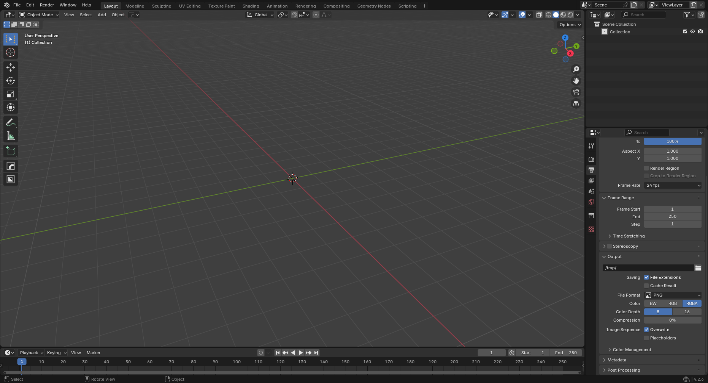
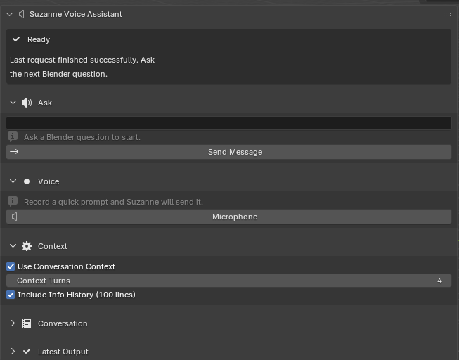

# Introduction

## Project overview

Blender is a free, open-source 3D creation suite used for modeling, animation, effects, simulation, and rendering [@blender-manual; @soni2023blenderreview]. It powers professional production pipelines and is increasingly used beyond entertainment in research, engineering, and higher education. For example, Blender has been used in engineering research to generate synthetic digital image correlation images for computational experiments [@rohe2022syntheticdic], in introductory engineering courses for simulation-based design activities involving satellite-motion analysis [@verner2024engineeringblender], and in higher-education chemistry instruction to help undergraduate and graduate students create visual scientific content [@nascimento2026blenderchem]. Because Blender is both powerful and freely available, it lowers financial barriers for students, independent artists, and early-career creators building portfolios on limited budgets.

However, Blender’s strength comes with a cost: a steep learning curve. Prior analyses of Blender’s interface highlight how beginners struggle with its dense layout, multi-editor environment, and mode-dependent tool system [@soni2023blenderreview]. New users must manage concepts such as object versus mesh data, operator conventions, modifier order, shading settings, and Python-driven tools long before they can produce high-quality work. This can slow progress, reduce confidence, and limit the number of completed portfolio pieces.

This project introduces **Suzanne**, a Blender add-on that lives in the right-hand **N-panel** and provides short, numbered, in-viewport steps for common tasks. Instead of searching externally for guidance while working, users receive instructions directly beside the 3D Viewport. The goal is to reduce context switching, help users execute reliably, and increase the number of polished artifacts that students and independent artists can publish.

{fig-cap="The Blender interface. Beginners juggle regions, modes, operators, and modifier order. Screenshot by the author." width=100%}

## Key terms and concepts

- **N-panel.** A vertical sidebar toggled with **N** in the 3D Viewport hosting add-ons and tools. Suzanne is located here to keep guidance directly inside the creative workspace [@blender-manual].

- **Mode.** Blender tools are mode-specific (e.g., Object Mode vs. Edit Mode). Many operators behave differently or are unavailable depending on the mode, making explicit mode requirements essential in step-by-step guidance [@blender-manual; @soni2023blenderreview].

- **Operator.** Any action invoked by menus, buttons, shortcuts, or the **F3** search. Naming operators (e.g., *Mesh > Normals > Recalculate Outside*) is key for reproducibility and structured documentation [@blender-manual].

- **Modifier stack.** A series of non-destructive operations whose **order** changes results. For example, applying Bevel before Subdivision Surface produces a different silhouette and shading than the reverse [@blender-manual].

- **Grounding.** Retrieval-Augmented Generation (RAG) combines large language models with authoritative sources. Integrating RAG ensures instructional steps match Blender’s official terminology and correct behavior [@gao2023retrieval].

{fig-cap="The Suzanne assistant in the N-panel. The interface keeps prompt entry, voice controls, context options, and response output directly inside Blender's workspace. Screenshot by the author." width=100%}

## Motivation

My motivation for this project is deeply personal. Over roughly six years of learning Blender, I repeatedly ran into the same problem: I often understood the *goal* of the task, but not the exact steps needed to carry it out. The hardest part was frequently not creativity, but information seeking. I had to stop working, search across videos, forum posts, Discord threads, and documentation, and then decide which explanation was correct for the version of Blender I was using. Research has shown that Blender’s growing scope and tool density can overwhelm newcomers and slow their learning process [@soni2023blenderreview]. My own experience closely matches that pattern of “micro-execution” friction: figuring out *which* operator to call, *what* mode to be in, and *what* order to perform actions.

This project is also motivated by gratitude toward the Blender community. As an open-source ecosystem, Blender has given me access to free tools, tutorials, documentation, and community support that shaped me not only as a 3D learner, but also as a person. Building Suzanne is therefore a way of giving something back. If the add-on can reduce the confusion that I experienced as a beginner, then it contributes to the same community that helped me grow. In that sense, Suzanne is both a technical system and a community-oriented teaching tool aimed at helping newer users feel less isolated when they get stuck.

Meanwhile, early-career 3D creators—students, hobbyists, and emerging artists—grow primarily through their portfolios. Recruiters and instructors evaluate:

- Clean topology visible in wireframe or clay renders  
- High-quality lighting and presentation  
- Turntables and breakdowns  
- UV layouts and readable materials  
- Clear process documentation

Students typically post these artifacts to ArtStation, Behance, GitHub Pages, or social media. However, producing consistent, high-quality work requires fluid execution, and execution is often slowed by searching for instructions outside the application.

Suzanne aims to address this gap: **deliver high-clarity, minimal-step instructions inside Blender**, grounded on authoritative documentation and consistent terminology.

This approach is supported by educational research showing that AI-based learning tools improve cognitive outcomes when instructional content is concise, context-specific, and directly actionable [@luo2025ailearningtools]. Suzanne follows these principles by placing guidance beside the active viewport and presenting it as small, verifiable steps that can be performed immediately.

Educational research offers a stronger rationale for this design than convenience alone. Worked-example studies argue that novice learners often benefit when instruction presents integrated, stepwise solutions instead of leaving them to infer hidden transitions between sparse hints [@Atkinson_2000]. Effective worked examples segment the task, keep relevant information close together, and reduce unnecessary search so learners can devote more attention to understanding the procedure itself [@Atkinson_2000]. In a Blender context, this matters because beginners are frequently not blocked by high-level artistic intention, but by small operational gaps: they know they need a modifier, a light, or a simulation domain, yet do not know the exact sequence of actions required to produce it.

Research on tutoring systems points in the same direction. VanLehn's review of human tutoring and intelligent tutoring systems suggests that step-based tutoring can approach the effectiveness of human tutoring more closely than answer-only instructional systems because it responds at the granularity where novices actually make mistakes [@VanLEHN_2011]. Suzanne adopts this principle by treating procedural micro-steps as its primary output. Rather than merely stating what the final scene should look like, the assistant is designed to specify the relevant mode, identify the correct operator or panel path, and enumerate the ordered actions needed to move from the current task state toward the desired result.

There is also a workflow argument for embedding this help inside Blender instead of leaving it in a browser tab. Studies of knowledge work show that people frequently shift between tasks and "working spheres," often every few minutes, and that interruptions may preserve speed only by increasing stress, frustration, and time pressure [@Gonz_lez_2004; @Mark_2008]. Blender learning is not identical to office work, but it shares the same reorientation burden: pause the artistic task, search for guidance elsewhere, translate the explanation back into the current interface state, and then recover momentum. Suzanne is therefore motivated not just by the desire to answer questions, but by the desire to reduce the interruption tax attached to routine learning.

## Problem statement

Blender learners lose time, motivation, and project momentum because most guidance lives **outside** the application, spread across long YouTube videos, scattered forum posts, or generic documentation. These sources are rarely tailored to the user’s current mode, object selection, or workflow context. As a result, beginners struggle with:

- Mode confusion  
- Misordered modifiers  
- Shading artifacts  
- Inconsistent steps from mixed-version tutorials  
- Difficulty reproducing actions from memory

The core gap is **micro-execution**: mode, operator, panel path, and modifier order.  
This project addresses that gap by building an in-viewport assistant that:

1. Returns verifiable steps inside the N-panel  
2. Grounds instructions on the official Blender Manual  
3. Uses retrieval techniques aligned with RAG best practices to maintain correctness [@gao2023retrieval]  
4. Supports small troubleshooting branches to handle common issues  

Because Blender is increasingly used in research and engineering [@rohe2022syntheticdic], reliable execution and clear documentation also support academic reproducibility.

## Project goals and implemented features

Because Suzanne is now implemented as a working Blender add-on, this thesis delivers both a design argument and a concrete feature set. The finished system is intended to:

1. **Provide in-viewport step-based teaching.** Return concise, numbered instructions directly in Blender’s N-panel using Blender’s operator names, panel paths, and explicit prerequisites such as mode, selection, and object type.

2. **Support flexible user input.** Let users ask for help through typed prompts or voice input so that guidance can fit different working styles and reduce the need to leave the viewport [@blender-manual].

3. **Preserve learning continuity.** Support follow-up interactions through local conversation history, allowing users to ask for the next step, request clarification, or continue a task without restarting the explanation from scratch.

4. **Offer context-aware assistance.** Allow recent conversation turns and optional Blender Info history to be attached so Suzanne can respond to what the user has just been doing rather than only answering decontextualized questions.

5. **Deliver reliable, beginner-readable feedback.** Surface clear status messages, validation errors, and recoverable failure states so the tool itself does not add more confusion to an already difficult learning environment.

6. **Focus on portfolio-relevant workflows and evaluate the result.** Prioritize guidance for modeling, lighting, rendering, and troubleshooting tasks that matter to student portfolios, and assess the finished prototype through software verification and task-based Blender experiments focused on reliability, instructional clarity, and workflow support.

## Public-facing dissemination

By spring 2026, Suzanne existed not only as a thesis artifact, but also as a publicly packaged prototype. I published a demonstration video, *ChatGPT Inside Blender? Meet Suzanne AI - Free Blender Addon*, on YouTube [@duverglas2026youtube] and deployed a beta distribution page, *Suzanne AI Voice Assistant for Blender*, on Gumroad [@duverglas2026gumroad]. These dissemination artifacts required the project to be explained in user-facing terms rather than only in research language: what the add-on does, which workflows it supports, what Blender version it targets, which dependencies it requires, and what limitations remain in the current beta release.

The Gumroad deployment is especially relevant because it frames Suzanne as something a real Blender learner could install and try rather than merely a conceptual design or a local classroom prototype [@duverglas2026gumroad]. The product page documents typed prompts, voice input, conversation memory, Blender-focused guidance, and platform-specific requirements such as Blender version support and `ffmpeg` availability on Linux [@duverglas2026gumroad]. Likewise, the YouTube video functions as a public demonstration of the add-on's intended workflow and communicates Suzanne's identity as a teaching-oriented assistant rather than an automation-first copilot [@duverglas2026youtube]. These public artifacts do not replace controlled evaluation, but they do show that the project advanced to a stage of packaging, explanation, and distribution consistent with real-world use.

## Assumptions, limitations, and delimitations

### **Assumptions**

This project rests on several practical assumptions about the environment in which Suzanne is used and the people who choose to install it:

- **Installed Blender and access to the N-panel.**  
  It is assumed that users already have a working installation of Blender and understand how to access the right-hand N-panel in the 3D Viewport [@blender-manual]. Suzanne is implemented as an N-panel add-on rather than a standalone application, so users must be able to enable add-ons, save .blend files, and navigate basic interface regions. The project does not attempt to teach operating-system installation, GPU drivers, or basic Blender navigation from scratch.

- **Informed consent for API usage.**  
  When users submit text or audio to Suzanne’s AI features, those requests are processed through a third-party API. The system assumes that users are aware of this and consent to it at the point of configuration—specifically, when they paste an API key into the add-on preferences and enable AI-driven features. The design presumes that users (or instructors, in a classroom setting) have reviewed relevant institutional or personal policies regarding the use of external AI services.

- **English-language interface as the baseline.**  
  The initial release assumes that Blender’s UI is set to English and that users can work with English operator names, menu labels, and instructions. Suzanne’s retrieval pipeline targets the English Blender Manual [@blender-manual], and the language model is prompted to mirror that vocabulary. Multilingual support and localization are identified as important directions for future work but are not treated as requirements for the first version.

- **Intermediate technical comfort.**  
  Although Suzanne targets novices in terms of Blender skill, it assumes a basic level of technical comfort: users can install add-ons, manage API keys, and understand the idea of “saving before running code.” The system does not, for example, guide users through package manager installation, shell configuration, or advanced debugging.

### **Limitations**

Despite careful design choices, Suzanne has several important limitations that shape how its results should be interpreted:

- **Residual inaccuracy in LLM-generated steps.**  
  Grounding on the Blender Manual and using retrieval-augmented generation improves factuality and terminology alignment, but it does not eliminate mistakes [@gao2023retrieval]. The model may still suggest slightly outdated menu paths, omit necessary steps, or assume a different initial selection than the user has. Users are therefore advised to treat Suzanne’s instructions as **high-quality suggestions**, not guaranteed truths, and to cross-check against the Manual or their own experience when something appears wrong.

- **Restricted code execution scope.**  
  For safety reasons, code execution is intentionally limited to a safe subset of Blender’s Python API, focusing on object creation, transforms, lights, cameras, and shader nodes. While this reduces the risk of destructive or security-sensitive operations, it also means that Suzanne cannot assist with every possible automation scenario. Advanced scripting tasks—such as complex rigging tools, file I/O, or integration with external render farms—are explicitly out of scope for the current version.

- **Version- and hardware-dependent behavior.**  
  Blender evolves rapidly, and operator locations, defaults, or UI layouts can change between releases [@blender-manual]. Suzanne targets a specific range of Blender versions during development; outside that range, some instructions may no longer match the interface exactly. Similarly, behavior can vary by platform (Windows, macOS, Linux) and hardware configuration (GPU vs CPU, different input devices). The project cannot guarantee identical behavior across all environments, and some user-reported issues may stem from these external differences.

- **Limited awareness of scene context.**  
  Suzanne has only partial visibility into the user’s scene state. While future versions might integrate deeper inspection tools, the current implementation often infers context from user prompts and a small set of requested scene details. This can lead to misalignment when the scene contains unusual setups (e.g., non-standard hierarchies, heavily customized keymaps, or add-on-specific data structures).

- **Evaluation scope.**  
  The evaluation described later in this thesis is constrained to a limited number of tasks, users, and time. Results about time-on-task, perceived usefulness, or error reduction should be interpreted as **initial evidence**, not definitive proof of general effectiveness across all Blender workflows or learner populations.

### **Delimitations**

In addition to inherent limitations, the project also includes deliberate **design choices** that narrow its scope. These delimitations are not weaknesses, but boundaries set so the work remains feasible and coherent:

- **Focus on learnability, modeling, shading, and presentation.**  
  Suzanne is explicitly aimed at core workflows that support beginner and intermediate portfolio pieces: modeling (especially hard-surface and simple organic forms), shading, lighting, and basic presentation (turntables, still renders). Advanced areas such as character rigging, complex simulation (fluids, cloth, smoke), geometry nodes systems, and compositing are intentionally left out of the initial feature set. This allows the project to concentrate on the “bread-and-butter” tasks that most early-career artists must master to build a credible portfolio.

- **No live microphone-based transcription in v0.x.**  
  Although speech-to-text could further reduce friction for some users, the current version does not implement live microphone capture or continuous audio transcription. All prompts are entered as text, and any audio-based features are limited to explicitly uploaded or recorded snippets. This avoids additional privacy and consent complexity and keeps the interaction model simpler for evaluation.

- **No end-user analytics or behavioral tracking.**  
  Suzanne does not collect telemetry or analytics about how users interact with the add-on. There are no built-in dashboards tracking which prompts are most common, which steps cause difficulty, or how often scripts are executed. While such data could be valuable for iterative design and research, it would also introduce significant privacy and governance concerns. Instead, this thesis relies on local software verification and authored task demonstrations rather than behavioral tracking or human-subject data collection.

- **No human-subject dataset in this thesis.**
  The thesis does not report survey responses, timing logs, or other human-subject study data. Claims are therefore limited to implemented system behavior, automated reliability checks, and the documented task-based experiments presented later. Formal user studies remain future work.

- **Single primary documentation source.**  
  For grounding, Suzanne relies primarily on the Blender Manual and does not, in this version, integrate other textual sources such as third-party books, course notes, or forum archives [@blender-manual]. This delimitation keeps the retrieval pipeline manageable and the terminology consistent, but it also means that insights from community best practices (for example, from popular tutorial series or studio pipelines) are only reflected indirectly through prompt design, not through direct retrieval.

By making these assumptions, limitations, and delimitations explicit, the thesis clarifies the conditions under which Suzanne is expected to work well and the boundaries beyond which its claims should be treated cautiously. Later chapters return to these points when interpreting evaluation results and outlining directions for future work.

## Ethical considerations

### **Privacy and consent**

Submitted prompts and audio files are processed through a third-party API. Research shows that large language models (LLMs) face serious risks related to privacy, data leakage, and unintended memorization of sensitive content, even when providers claim to filter or anonymize data [@daspaper2025llmsecurity]. In the context of student work and personal projects, leaked prompts could reveal identifying details, coursework, or unpublished research, including descriptions of in-progress thesis ideas, screenshots of original models, or references to real people. Since Blender is often used to create highly personal or autobiographical work, these risks are not abstract; a prompt describing a “self-portrait scene in my dorm room at Allegheny” can easily become identifying if mishandled.

To reduce these risks, Suzanne adopts a **local-first** design wherever possible. API keys are stored only on the user’s machine, inside Blender’s add-on preferences, and are never transmitted to any external server controlled by the add-on developer. Suzanne does not implement its own logging of prompts or responses; once a session ends, there is no add-on-level history of user queries. The only data sent to the third-party provider is the text and/or audio that the user explicitly submits as part of a request. The interface includes clear warnings about avoiding sensitive material (e.g., real names, proprietary data, or confidential assets), and the documentation encourages users to consult institutional policies on AI tool usage before integrating Suzanne into graded coursework or research workflows.

In any future formal study of Suzanne, volunteers should be informed about what data leaves their machine, which provider processes it, and how long it may be retained according to that provider’s terms [@daspaper2025llmsecurity]. They should also be able to disable API-based features entirely and still use the add-on as a structured reminder of manual workflows grounded in the Blender Manual [@blender-manual]. In classroom settings, instructors are encouraged to provide alternative, non-AI pathways to complete assignments so that students who are uncomfortable with third-party processing are not penalized.

### **Reliability and user control**

While grounding on the Blender Manual and retrieval-augmented generation reduces some errors, LLMs remain fallible and can still propose incorrect or incomplete sequences of steps [@gao2023retrieval; @daspaper2025llmsecurity]. For example, a generated workflow might reference an operator that moved in a newer Blender version, assume the wrong selection mode, or omit a crucial modifier step. Survey research on AI systems emphasizes that tools used in high-stakes or educational contexts must be designed around human oversight, transparency, and reversible actions to maintain user trust [@daspaper2025llmsecurity]. An assistant that silently edits the scene or hides its reasoning would be misaligned with these principles.

Suzanne therefore treats the model as an *advisor*, not an authority. It always displays instructional steps before any changes are applied and explicitly labels them as suggestions that should be verified by the user. When code snippets are generated, they appear in a dedicated panel where users can inspect the Python before deciding whether to run it. Code execution is strictly opt-in: Suzanne never executes code automatically in response to a prompt. Users must press a separate confirmation button, reinforcing the mental separation between “seeing advice” and “changing the scene.”

Blender’s own undo stack is highlighted as the primary recovery mechanism if something behaves unexpectedly. The add-on’s documentation recommends that users save incremental versions of their .blend file (for example, `scene_v03.blend`, `scene_v04.blend`) before experimenting with code-driven changes. The interface also encourages users to cross-check instructions against the Blender Manual when results look suspicious or differ from expectations [@blender-manual]. In effect, the design continually nudges users to maintain **interpretive control**: Suzanne can suggest the next move, but the user decides whether it is appropriate for their current scene and learning goals.

### **Bias and inclusivity**

Educational research on AI-based learning tools highlights the importance of clear, accessible feedback that supports diverse learners, rather than favoring only those with high prior knowledge or specific linguistic backgrounds [@luo2025ailearningtools]. Blender itself already presents a high barrier to entry: the interface is dense, the terminology is specialized, and much community documentation assumes familiarity with English technical jargon and gaming culture. Without care, an AI assistant could easily amplify these barriers—by using slang, skipping explicit prerequisites, or tailoring examples to a narrow subset of users.

Suzanne’s instruction style is therefore intentionally **plain and procedural**. Each step names the relevant mode, operator, and UI path instead of assuming tacit knowledge or relying on vague phrases like “clean up the mesh.” For instance, instead of saying “fix the shading,” Suzanne might say “Switch to *Object Mode*, select the object, then choose *Object > Shade Smooth* and enable *Auto Smooth* in the *Object Data Properties > Normals* panel.” This benefits students, self-taught artists, and non-native English speakers who may be less familiar with community slang or informal tutorial styles. It also supports learners who prefer to map instructions carefully to the interface rather than following along with a video at the instructor’s pace.

At the same time, the project acknowledges that underlying language models can encode societal biases in examples, metaphors, or suggested asset names [@daspaper2025llmsecurity]. To mitigate this, Suzanne intentionally scopes its responses toward **technical actions** (operators, modes, and parameters) and away from content that labels or describes people. The documentation discourages prompts that rely on demographic stereotypes (e.g., asking for “typical” appearances of certain groups) or that seek value judgments about whose work “looks better.” When portfolio examples are mentioned, they are framed in terms of topology cleanliness, lighting clarity, and presentation conventions, not in terms of personal attributes. The long-term goal is to support skill-building and confidence, particularly for learners who may not see themselves represented in mainstream 3D education spaces.

### **Cost transparency and outages**

LLM providers can change pricing, rate limits, and model availability with little notice. This volatility is especially relevant for students and independent artists working with limited budgets, who may not be able to absorb unexpected charges or interruptions. A tool that quietly consumes API credits in the background or fails without explanation would undermine both trust and accessibility.

Suzanne addresses this by making **API usage explicit and interruptible**. The add-on requires users to paste their own API key rather than bundling any shared or hidden key, which makes the cost relationship clear: any charges are between the user and the provider. When an API request fails—because of quota exhaustion, authentication errors, or network issues—Suzanne surfaces explicit error messages rather than silently falling back to an empty response. Users are pointed toward their provider dashboard to check usage and are encouraged to set their own spending limits.

Whenever API-based features are unavailable, Suzanne falls back on workflows grounded in Blender’s official practices—for instance, pointing users directly to relevant sections of the Blender Manual or suggesting manual operator paths [@blender-manual]. In classroom scenarios, instructors can choose to disable the API-dependent features entirely and still use the add-on as a structured, manual recipe panel. This ensures that the tool remains a useful learning aid even when AI services are unavailable or unaffordable, and it reinforces that the core knowledge lives in Blender’s open documentation rather than in any single commercial model.

### **Security and scope**

Because unrestricted Python execution in Blender can cause serious harm—from deleting or corrupting scenes to interacting with the file system or network—Suzanne deliberately limits what kind of code it can propose. Security surveys of LLMs warn that generated code can be manipulated or misused to escalate privileges, exfiltrate data, or perform other unintended actions, especially when execution is automated or opaque [@daspaper2025llmsecurity]. Blender add-ons that expose “run arbitrary code” endpoints without constraints effectively grant the model the same power as an expert user with full access to the scene and environment.

In response, Suzanne restricts script generation to a narrow slice of Blender’s API: object creation, transforms, lights, cameras, and shader nodes. Operations such as deleting objects, applying all modifiers, or resetting entire scenes are either excluded or heavily discouraged. The add-on explicitly avoids file operations (opening, saving, or deleting files), external network calls, or direct system-level access, thereby reducing the potential attack surface. Any script that appears in the UI is kept short enough for a motivated user to skim, and it is formatted clearly so that parameter values and operator names are visible.

Suzanne also leverages Blender’s existing safety mechanisms. Scripts run within Blender’s Python environment, which already exposes undo and redo for most scene operations. Users are encouraged to save .blend files frequently and to experiment on copies rather than production scenes. The documentation includes a “safety checklist” that recommends: (1) saving before executing any script, (2) inspecting code for obviously destructive calls, and (3) using undo immediately if an unexpected change occurs. These guardrails do not eliminate all risk, but they align Suzanne with best-practice recommendations for LLM-driven code execution: minimize permissions, maximize visibility, and keep humans firmly in control [@daspaper2025llmsecurity]. In combination with the privacy and consent measures above, this scoped design aims to make Suzanne a responsible, student-friendly integration of AI into Blender rather than a source of hidden technical or ethical debt.

## Chapter roadmap

The remainder of this thesis proceeds as follows:

- **Related Work** reviews Blender learning challenges, prior add-ons, AI tutoring systems, RAG-based grounding, and safe model usage.  
- **Methods** details the N-panel UI, retrieval pipeline, grounding strategy, and safe code execution model.  
- **Evaluation** presents the study design, tasks, metrics, and analysis. 
- **Discussion** interprets results and limitations.  
- **Future Work** explores multilingual support, richer scene graph awareness, and expanded tool-calling capabilities.
