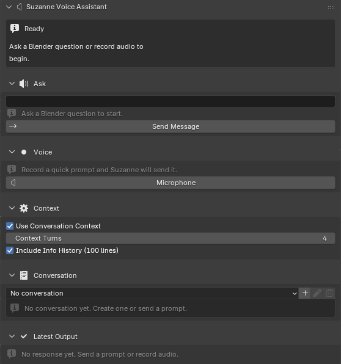

# Methods

This chapter explains how Suzanne was designed, implemented, and prepared for evaluation as an in-viewport Blender assistant. The Introduction established the core problem as micro-execution friction (mode, operator, panel path, and action order), while Related Work positioned Suzanne against two common alternatives: external learning resources and automation-first AI add-ons [@blender-manual; @soni2023blenderreview; @blendergpt; @blender-mcp]. Methods therefore focuses on *how* the system operationalizes those insights in software, interface behavior, and safety controls.

The project follows a design-and-build methodology common in applied HCI and educational tooling:

1. Define requirements from literature and practice (Blender learning pain points, in-context tutoring needs, and safety constraints).
2. Build an executable prototype inside Blender's N-panel.
3. Iterate on reliability and usability through repeated local testing in authentic modeling workflows.
4. Prepare measurable outputs for a later experimental chapter (task time, completion quality, and perceived usefulness).

Rather than treating model responses as opaque outputs, the implementation treats each interaction as a reproducible pipeline: user input -> validated request -> model response -> formatted procedural output in the viewport. This pipeline orientation is central to the methodological goal of reducing context switching and improving repeatable task execution.

## Development process

### Phase 1: Requirement extraction

Requirements were extracted from three sources: (a) Blender documentation and interface behavior [@blender-manual], (b) prior studies on beginner friction in Blender [@soni2023blenderreview], and (c) AI-learning-tool findings emphasizing in-context and actionable guidance [@luo2025ailearningtools].

The resulting requirement set emphasized:

- Locality: assistance must appear in the active workspace, not in a separate website.
- Procedural clarity: responses should be short, ordered, and immediately actionable.
- Safety: no silent scene modifications and no hidden execution of generated code.
- Practical deployment: installation and operation should fit student hardware and software constraints.

### Phase 2: Prototype architecture and implementation

The first implementation target was a Blender add-on written in Python against Blender's `bpy` API and loaded through the standard add-on registration system (`register()` / `unregister()`). Persistent interaction state is stored in `Scene` properties, user-level configuration is stored in add-on preferences, and local conversation history is persisted to disk with a temporary-directory fallback. This choice aligns with Blender's architecture and keeps the workflow entirely in-app [@blender-manual].

The implementation was divided into a small set of focused modules so that interface code, mutable state, and side-effecting operations could be reasoned about separately during debugging and testing. The add-on entry point (`__init__.py`) declares add-on metadata, imports the registered classes, and coordinates `register()` / `unregister()` calls. The sidebar UI is defined in `panel.py`; per-scene state registration and cleanup live in `state.py`; side-effecting actions such as text submission, microphone capture, diagnostics, and conversation management live in `operators.py`; add-on-level settings such as API key, model selection, audio device handling, and diagnostics UI live in `preferences.py`; and shared helpers for HTTP requests, Info-history capture, local storage, audio-device enumeration, and UI text cleanup live in `common.py`. This modular split made it easier to trace failures to either presentation logic, state wiring, or external-process/network behavior.

Core interaction paths were implemented as operators:

- Text path: submit prompt -> optionally attach recent conversation turns and Blender Info history -> receive response.
- Voice path: start/stop microphone capture -> transcribe -> optionally attach recent context -> submit transcript -> receive response.
- Conversation path: create, select, rename, delete, and preview local conversations.
- Utility path: API-key validation, model refresh, microphone/transcription diagnostics, and recordings-folder access.

### Phase 3: reliability hardening

After the initial feature set worked end-to-end, iteration prioritized failure behavior rather than feature expansion. The main hardening tasks were:

- Clear status signaling (`Ready`, `Recording...`, `Sending...`, `Error`).
- Explicit handling for missing keys, missing files, empty transcripts, empty outputs, and HTTP failures.
- Local fallback logic for recordings and conversation storage when add-on directories are not writable.
- UI formatting logic for long responses, output previews, and empty states so multi-step instructions remain readable in the panel.

These hardening steps were chosen because the dominant user risk in educational contexts is not only wrong answers, but interrupted or confusing workflows that break learner momentum.

### Phase 4: evaluation readiness

The final development phase prepared the system for controlled comparison in later chapters by stabilizing the feature surface and defining what is considered in-scope behavior for experiments. At this stage, Suzanne is treated as a mixed-initiative assistant: it recommends, the user decides, and all scene edits remain user-mediated.

## System requirements and traceability

To keep claims testable, each major thesis goal was mapped to an implementation responsibility and observable system behavior.

Table: Requirement-to-implementation traceability for Suzanne

| Requirement | Design decision | Observable behavior |
|:--|:--|:--|
| In-viewport assistance | N-panel integration in `VIEW_3D` | User never leaves Blender to ask for help |
| Procedural responses | Prompt shaping + UI formatting for numbered steps | Output appears as short action sequence |
| Input flexibility | Text prompt plus microphone-driven flow | Both typed and spoken intents are supported |
| Context-aware help | Optional conversation memory and Blender Info-history attachment | Responses can incorporate recent workflow context when enabled |
| API transparency | Explicit key entry in preferences and key-test operator | User can verify connectivity before tasks |
| Fault tolerance | Guard checks and HTTP/IO error handling | Failures are visible and recoverable |
| Safety-first behavior | No automatic scene mutation from generated text | User remains the final actor |
| Responsible deployment | Local storage of settings, conversations, and recordings with no telemetry path | Lower privacy exposure for student use |

This traceability table shaped coding priorities and chapter-level evaluation planning.

## System architecture

Suzanne is implemented as a Blender-resident, event-driven assistant with three layers:

1. Interface layer: collapsible `Status`, `Ask`, `Voice`, `Context`, `Conversation`, and `Latest Output` cards in the N-panel.
2. Orchestration layer: operators that manage validation, request sequencing, recording toggles, conversation management, and state transitions.
3. Service layer: network calls for transcription and response generation, local audio capture utilities, and local JSON-backed conversation storage.

The architecture is intentionally simple because reliability and transparency were prioritized over autonomous behavior. Instead of hidden background orchestration, each major transition is user-triggered and surfaced in the UI.

{fig-cap="Figure 3. Current in-viewport deployment of Suzanne in the right-hand N-panel. The interface keeps prompt entry, voice capture, context controls, conversation memory, and output review spatially coupled to Blender's workspace. Screenshot by the author." width=100%}

In the implemented pipeline, the assistant does not introspect the full scene graph automatically. Scene awareness is inferred primarily from user prompts plus optional attached context: recent local conversation turns and the last 100 lines of Blender's Info history. This keeps integration lightweight while still allowing limited context-sensitive assistance, though it constrains precision for unusual scenes or workflows not visible in the recent interaction history.

## Blender integration details

### Add-on entry point and module boundaries

Suzanne is packaged as a conventional Blender add-on rather than as a standalone Python application. At load time, the add-on registers a preferences class, multiple operator classes, and a single sidebar panel class, then creates its runtime `Scene` properties and ensures that the recordings directory exists. This startup sequence matters methodologically because it determines which features are available immediately after enablement and which state fields Blender persists for the session. In concrete terms, the entry point first registers the preferences UI, then the interaction and diagnostic operators, and finally the `VIEW_3D` sidebar panel that exposes Suzanne inside Blender's right-hand N-panel. Unregistration reverses that order and explicitly removes the `Scene` properties before class teardown so repeated enable/disable cycles do not leave stale state attached to Blender's runtime.

The module boundaries were chosen to mirror the system responsibilities described earlier in the chapter:

- `__init__.py`: metadata, Blender compatibility declaration, and class registration order.
- `panel.py`: N-panel layout, status rendering, collapsible-card drawing, conversation previews, and latest-output preview behavior.
- `state.py`: creation and cleanup of all `Scene` properties used to drive runtime state and UI visibility.
- `operators.py`: text-send flow, voice-recording flow, diagnostics utilities, and conversation create/rename/delete actions.
- `preferences.py`: API key entry, model and device selection, storage options, and diagnostics display.
- `common.py`: shared helper functions for prompt construction, Info-history extraction, local conversation storage, audio tooling, and API transport.

Because these responsibilities are separated in code, later verification work could test panel behavior, state registration, and operator execution as distinct concerns rather than as one monolithic interaction.

### Registration and state model

Suzanne follows Blender add-on conventions for class registration and property initialization [@blender-manual]. During registration, the add-on registers all Blender-visible classes, calls `ensure_props()` to attach runtime properties to `bpy.types.Scene`, and attempts to create a local recordings directory. During unregistration, those properties are explicitly removed with `clear_props()` before classes are unregistered. This ordering was chosen to avoid stale UI state and to make repeated enable/disable cycles predictable during testing.

Runtime interaction data is maintained in `Scene` properties rather than in `WindowManager` properties because scene-bound state proved more reliable and naturally scoped the assistant's state to the active `.blend` file. In implementation terms, the registered fields fall into four groups:

- **Interaction state:** microphone-active flag, status string, last audio path, last transcript, last response, and current prompt text.
- **Context and conversation state:** active conversation selection, whether conversation context is enabled, how many turns are attached, whether Blender Info history is attached, and the most recent captured Info-history block.
- **Section-visibility state:** booleans controlling whether the `Ask`, `Context`, `Conversation`, `Voice`, and `Latest Output` cards are expanded or collapsed.
- **Output-presentation state:** selected output view (`response` vs. `transcript`) and the expand/collapse toggles for long transcript and response text.

The runtime interaction fields include:

- Current status string.
- Current message prompt.
- Last transcript text and last model response.
- Last recorded audio file path.
- Active conversation selection and conversation-context settings.
- Info-history attachment toggle and the last captured Info-history block.
- Latest-output view and transcript/response expansion state.

Configuration values (API key, response/transcription model selections, audio-device handling, file prefix, conversation auto-save behavior, and diagnostics feedback) are stored in add-on preferences. This separation was chosen so task state and configuration state remain distinct and easier to reason about during testing: scene properties describe what the current interaction is doing, while preferences describe how the add-on is configured in general.

For reproducibility, it is also useful to state the storage logic explicitly. Recordings are written first to an add-on `recordings/` directory, and if that location is unavailable the method falls back to a temporary directory so microphone trials still complete. Conversation history is stored separately in a JSON file (`suzanne_conversations.json`) inside an add-on `data/` directory, again with a temporary-directory fallback when necessary. This means a reproduction attempt can verify not only the visible panel behavior, but also whether the expected local artifacts were created after text and voice runs.

### Panel design and interaction constraints

The panel is now structured around a set of Blender-native collapsible cards: `Status`, `Ask`, `Voice`, `Context`, `Conversation`, and `Latest Output`. This layout keeps the primary interaction loop visible while allowing supporting controls to remain compact until needed.

In implementation terms, each card is built with Blender's `layout.panel_prop(...)` mechanism and is bound to a corresponding `Scene` boolean property. The implemented properties are `suzanne_va_show_message`, `suzanne_va_show_context`, `suzanne_va_show_conversation`, `suzanne_va_show_recording`, and `suzanne_va_show_output`. This means the expanded/collapsed state of a card is itself part of the assistant's stored runtime state rather than an untracked UI detail. The design was intentional: a beginner who opens the `Context` or `Conversation` card for one task should be able to continue that task without re-opening controls every redraw.

Each card has a narrow functional role:

- The `Status` card maps raw status strings such as `Idle`, `Recording...`, `Sending...`, `Idle (sent)`, and `Idle (error)` to user-facing labels, icons, and alert styling.
- The `Ask` card presents the text prompt field and the send operator, and shows a disabled hint when the prompt box is empty.
- The `Voice` card exposes a single microphone button that toggles between starting and stopping recording.
- The `Context` card exposes the toggles for attaching recent conversation turns and Blender Info history.
- The `Conversation` card provides an enum selector plus create, rename, and delete operators, along with a short preview of recent saved exchanges.
- The `Latest Output` card can switch between response and transcript views and truncates long text unless the user expands it.

The `Latest Output` card is especially important for reproducibility because it makes the post-request state inspectable. Rather than replacing one output with another, the panel stores both the last transcript and the last response and lets the user choose which view to inspect. Separate expand/collapse toggles are maintained for each view so long outputs can be previewed briefly during normal use and then expanded during debugging or evaluation write-up. This small implementation detail matters because it preserves evidence of what the transcription model heard and what the response model produced without forcing the user to leave Blender to inspect logs.

The interaction loop is:

1. Enter (or dictate) intent.
2. Optionally attach recent conversation turns or Blender Info history.
3. Send request.
4. Read the latest transcript or step-oriented response.
5. Apply steps manually in the scene.

A single microphone button toggles recording on/off to reduce control-surface complexity for beginners. The status card updates on each transition, functioning as lightweight feedback for asynchronous operations (recording, network request, response rendering). Empty states in the `Conversation` and `Latest Output` cards make it clear when no history or response is available yet, and long transcripts or responses can be expanded in place when necessary. The overall goal of this structure is not visual novelty; it is to keep prompt entry, context control, and response review spatially coupled so that learners do not need to leave the viewport to manage the assistant itself.

### Cross-platform audio capture strategy

Because Blender is cross-platform and student devices vary, audio capture was implemented with OS-specific command paths:

- Linux: `ffmpeg` with ALSA input, with PulseAudio candidates available as fallback.
- Windows: `ffmpeg` with WASAPI and DirectShow candidate paths.
- macOS: bundled `atunc` utility for capture.

Recorded files are normalized to mono 16 kHz WAV for consistent transcription behavior. Candidate recorders are tried in sequence until one remains alive, which makes the voice method more portable across personal laptops, lab machines, and OS-specific microphone stacks. If the add-on directory cannot store recordings, the system falls back to a temporary directory. This avoids hard failures in locked-down lab environments.

## End-to-end interaction workflows

### Text workflow

The text path was designed for direct, low-latency interaction from the viewport.

```text
Algorithm 1: Text request handling
Input: user_prompt
Output: formatted procedural response in N-panel

1: if user_prompt is empty then
2:     show validation error in panel
3:     return
4: end if
5: read API key from add-on preferences
6: if API key missing then
7:     show key error and return
8: end if
9: collect optional conversation context and Blender Info history if enabled
10: apply Blender-only prompt prefix and build request payload
11: send request to response model endpoint
12: parse output_text (or structured fallback content)
13: store response in scene state and append local conversation exchange
14: render wrapped lines in response box
```

This workflow is intentionally explicit and synchronous from the user's perspective. There are no hidden retries or silent fallbacks that could obscure what happened during a request.

In the actual implementation, this flow is handled by the `SUZANNEVA_OT_send_message` operator. The operator trims and validates the prompt, checks that an API key is present in add-on preferences, optionally captures the last 100 lines of Blender Info history, optionally appends recent conversation turns from the selected local conversation, builds a markdown-structured request block, and prepends a Blender-only domain constraint before sending the payload to the response endpoint. If the primary `output_text` field is absent, the code falls back through nested message content to reconstruct the response text. The operator then stores the prompt and response in `Scene` properties, resets the transcript/response expansion booleans, appends the exchange to local conversation storage, updates the status string, and triggers UI redraw.

This operator-level description matters because it reveals the implementation language of the method. The workflow is not handled by hidden JavaScript, web middleware, or a separate desktop service; it is implemented directly in Python as a Blender operator that can be inspected, invoked, and tested through Blender's own event model. Another developer reproducing the tool would therefore need to reproduce not only the prompt design but also the operator lifecycle, `Scene` property updates, and redraw logic that make the response visible inside the viewport.

### Voice workflow

The voice path extends the text workflow by inserting capture and transcription stages.

```text
Algorithm 2: Voice request handling
Input: microphone toggle events
Output: transcript + procedural response in N-panel

1: on first press, start recording process and set status=Recording
2: on second press, stop process and wait for output file
3: if file missing then show error and abort
4: send audio file to transcription endpoint
5: if transcript empty then show error and abort
6: collect optional conversation context and Blender Info history if enabled
7: apply Blender-only prompt prefix
8: send transcript to response endpoint
9: store transcript, file path, response, and local conversation exchange
10: render transcript and response in panel
```

This two-press model was selected over push-to-talk hold behavior because it lowers motor-demand complexity for novices and allows longer utterances without continuous key holding.

In code, the voice path is implemented by the `SUZANNEVA_OT_microphone_press` operator, which uses a single-toggle model: the first press starts capture and the second press stops it and sends the result. The recording stage selects an operating-system-specific backend: `ffmpeg` with ALSA or PulseAudio candidates on Linux, `ffmpeg` with WASAPI or DirectShow candidates on Windows, and a bundled `atunc` utility on macOS. Candidate recorders are tried in sequence until one remains alive, which makes the method more reproducible across different lab and personal-machine setups. Audio is written as mono 16 kHz WAV; if the add-on directory is not writable, the recording path falls back to a temporary directory. After the second press, the operator terminates the recorder process, waits for the file to appear, submits it to the transcription endpoint, reuses the same conversation/context attachment logic as the text path, and then sends the transcript to the response endpoint. The operator writes the resulting transcript, response, and file path back into `Scene` properties and updates the panel state so the `Latest Output` card can render the result immediately.

This operator also clarifies an implementation choice the professor's comment points toward: the collapsible cards and algorithms are connected through explicit state transitions rather than through a background service. The `Status` card is updated as the operator moves from `Recording...` to `Stopping...` to `Sending...` and finally to `Idle (sent)` or `Idle (error)`. Because those statuses are ordinary `Scene` properties, the same UI elements that support normal use also expose the control flow needed to debug a failed reproduction attempt.

## Network and model interaction layer

### API endpoints and payload flow

The implementation uses HTTPS requests to model APIs for two tasks:

- Audio transcription (`/v1/audio/transcriptions`) with multipart file payloads.
- Text response generation (`/v1/responses`) with JSON payloads.

A lightweight key-test operation (`/v1/models`) is provided in preferences to reduce setup uncertainty before first use. This small affordance significantly reduced setup friction during internal testing because users can distinguish key issues from prompt-quality issues.

### Error handling and response robustness

The system treats network interaction as failure-prone and therefore includes guarded parsing and user-facing error messages for:

- Missing or malformed API keys.
- HTTP transport failures.
- Non-JSON or unexpected response structures.
- Empty transcripts or empty model outputs.

When primary response fields are absent, the parser attempts structured fallback extraction from nested output content. This improves resilience across model-response format differences while keeping the UI contract stable.

## Grounding and response-formation strategy

A major methodological goal is grounding outputs in authoritative Blender language so instructions remain reproducible and verifiable [@blender-manual; @gao2023retrieval]. The full grounding strategy is defined in three layers:

1. **Domain constraint layer.** An always-applied Blender-only prefix prevents off-domain drift and keeps responses task-focused.
2. **Terminology alignment layer.** Prompting style favors explicit mode names, operator names, and panel paths.
3. **Retrieval layer.** A retrieval-augmented extension is specified to inject relevant Manual passages before generation.

The current evaluated build implements layers (1) and (2) directly and is architected to accept layer (3) as a modular extension. This allows transparent reporting of what is already operational versus what is specified for the full thesis target.

For the retrieval extension, passage ranking follows standard vector-similarity scoring [@gao2023retrieval]:

$$
\mathrm{score}(q, d_i) = \cos(\mathbf{e}_q, \mathbf{e}_{d_i}) =
\frac{\mathbf{e}_q \cdot \mathbf{e}_{d_i}}{\|\mathbf{e}_q\|\,\|\mathbf{e}_{d_i}\|}
$$

where $\mathbf{e}_q$ is the query embedding and $\mathbf{e}_{d_i}$ is the embedding of document chunk $d_i$. Top-ranked chunks are then inserted into the generation context to reduce terminology drift and menu-path hallucination.

### Response schema for procedural clarity

Regardless of input modality, the response format is designed to preserve instructional structure:

- Short, ordered steps.
- Explicit prerequisite states (mode, selection assumptions).
- Concrete operator/menu naming where possible.
- Troubleshooting branches when likely failure points are detected.

This schema reflects findings from AI-learning literature that actionable, context-proximate feedback is more useful than generic prose [@luo2025ailearningtools].

## Safe code-assistance model

Related work showed that automation-first Blender copilots often execute generated code quickly, which improves speed but can increase risk [@blendergpt; @blender-mcp; @daspaper2025llmsecurity]. Suzanne's method is deliberately conservative:

- Primary output is human-readable procedure, not autonomous execution.
- Any code-like content is treated as optional scaffolding for user inspection.
- Scene changes remain user-initiated in Blender.

For the planned guarded execution extension, the policy model includes:

1. Explicit confirmation before any run action.
2. Restricted operation classes (object creation/transforms/lights/cameras/shader nodes).
3. Blocked operations for high-risk file/network/system effects.
4. Immediate rollback guidance using Blender's undo stack.

By separating *advice* from *execution authority*, the method keeps user agency central and aligns with security guidance on minimizing model-side permissions [@daspaper2025llmsecurity].

## Responsible-computing controls in implementation

Ethical concerns were translated into concrete implementation controls rather than left as abstract policy.

### Privacy and data minimization

- API keys are user-supplied in local add-on preferences.
- No separate telemetry service is embedded in the add-on.
- Conversation history and recordings are stored locally on the user's machine.
- Data sent externally is limited to explicit user inputs plus any context blocks the user chooses to attach (recent conversation turns and/or recent Blender Info history).

This local-first approach reduces unnecessary data propagation while acknowledging that third-party API processing remains part of the architecture [@daspaper2025llmsecurity].

### Transparency and cost visibility

The system surfaces failures directly (e.g., key, quota, network, decode) instead of silently degrading output quality. Making failure modes visible helps users manage API budgets and prevents misattributing infrastructure issues to user competence.

### Inclusivity by instruction style

UI output is cleaned and line-wrapped for readability, and markdown-heavy formatting is normalized before display. The intent is to improve clarity for novices and non-native readers by emphasizing operational language over stylistic flair.

## Implementation environment and reproducibility

### Software stack

The prototype runs as a Blender add-on for Blender 5.0.0+ [@blender-manual], using Python within Blender's runtime and Blender's `bpy` API for registration, layout, operators, and persistent properties. Standard Python libraries handle process management, filesystem interaction, JSON storage, and HTTP orchestration. The evaluated implementation consists of one sidebar panel, multiple Blender operators, one add-on preferences class, and a set of helper utilities for prompt formatting, local storage, and API transport. External tooling dependencies are intentionally minimal:

- `ffmpeg` (Linux/Windows) for microphone capture.
- bundled `atunc` utility (macOS) for microphone capture.
- Network access to model APIs for transcription and response generation.

Within Blender, the preferences surface stores or selects the following configuration values: API key, response model, transcription model, system-default audio input device, recording filename prefix, conversation auto-save behavior, and diagnostics messages. Local persistent data is split across two locations: recordings are written to an add-on `recordings/` directory when possible, while conversation history is written to a local `suzanne_conversations.json` store in an add-on `data/` directory with a temporary-directory fallback when needed.

Reproducing the tool therefore requires more than matching model endpoints. A faithful rebuild would need: (a) the Blender add-on packaging structure, (b) Python classes for preferences, operators, and panel drawing, (c) `Scene` properties for status, prompt, transcript, response, context toggles, and card visibility, and (d) local storage paths for recordings and conversation JSON. These elements together are what make Suzanne an in-viewport assistant rather than a generic external chatbot.

### Reproducibility protocol

To support repeatable demonstrations and evaluation setup, the following run protocol was used:

1. Install Blender 5.0.0 or newer and enable the Suzanne add-on through Blender's add-on manager.
2. Confirm that the add-on appears in the `3D Viewport > N-panel > Suzanne` location and that registration created the expected sidebar controls.
3. Open add-on preferences and configure the API key, response model, transcription model, filename prefix, and conversation auto-save setting.
4. Run the built-in diagnostics (`Test API Key`, `Test Microphone`, and `Test Transcription`) before task execution so setup errors are separated from task-performance observations.
5. Verify that the local storage paths are working by confirming that the recordings folder can be opened from preferences and that local conversation storage is available.
6. Choose whether to run a text trial, a voice trial, or both. For text trials, type the benchmark prompt in the `Ask` card and submit it. For voice trials, press the microphone button once to begin recording and once again to stop and submit.
7. Set context options for the run: whether local conversation context is enabled, how many context turns are attached, and whether the last 100 lines of Blender Info history are included.
8. After a request completes, inspect the `Latest Output` card in both `response` and `transcript` modes, verify that the status string reached a successful idle state, and confirm that any expected local artifacts (WAV file or JSON conversation entry) were created.
9. Record environment metadata for each run, including Blender version, operating system, response model, transcription model, whether Info history was enabled, whether conversation context was enabled, whether normal or fallback storage paths were used, and which path (text or voice) was used.
10. After each task, inspect the latest transcript/response, local conversation history, and any diagnostics output to document whether the pipeline behaved as expected.

Because Blender versions and OS audio stacks vary, environment metadata (OS, Blender version, selected models, whether conversation or Info-history context was enabled, and whether local storage used normal or fallback directories) is logged as part of experiment setup documentation. A reproduction attempt that omits this metadata would make it difficult to determine whether a difference in behavior came from the add-on itself or from the surrounding machine and Blender environment.

### Versioned capability statement

To avoid overclaiming, methods reporting distinguishes current implementation from scoped extension work.

Table: Implemented capabilities versus scoped extensions

| Capability area | Implemented in current build | Scoped extension |
|:--|:--|:--|
| In-viewport text assistant | Yes | N/A |
| Voice capture and transcription | Yes | N/A |
| Blender-only domain gating | Yes (always-on prompt prefix) | Richer intent classification |
| Conversation/context support | Yes (local conversation memory + optional Info-history attachment) | Deeper scene introspection and richer grounding |
| Retrieval grounding from Manual | Partial (prompt-level alignment) | Full chunk retrieval + citation injection |
| Procedural step formatting | Yes | Adaptive difficulty/fading |
| Code execution inside add-on | No autonomous execution | Guarded, opt-in constrained runner |
| User safety controls | Yes (validation/status/errors) | Formal policy engine and audit trails |

This separation supports methodological integrity: the chapter captures both delivered engineering work and the explicit next-step architecture required to fully realize the thesis design goals.

## Methods-level limitations

Several methodological constraints influence interpretation of later results:

- Scene-context inference is still indirect: it relies on prompts, recent conversation turns, and Info-history snapshots rather than full scene introspection.
- Grounding is currently strongest at terminology/prompt levels, with full RAG integration staged as extension work.
- API-dependent behavior introduces latency and availability variability outside Blender control.
- Microphone quality and device configuration can affect transcription quality and therefore downstream instruction quality.

These limits are not hidden defects; they are declared boundaries that shape valid claims in evaluation and discussion chapters.

## Transition to evaluation

This Methods chapter established the system design and implementation pipeline used to operationalize Suzanne as an in-viewport instructional assistant. The next chapter evaluates this method through software verification and task-based experiments aligned with portfolio-relevant Blender tasks.
